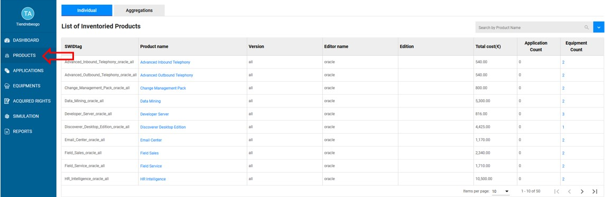
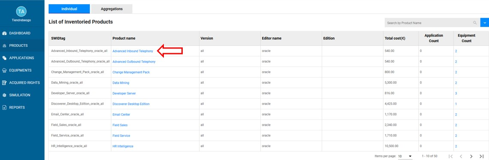
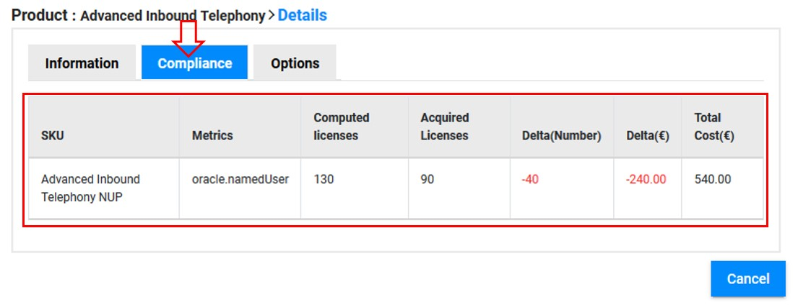
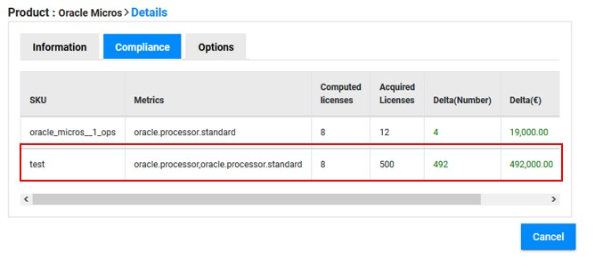

<link rel="stylesheet" href="../../../css/enlargeImage.css" />

# Check compliance for one product

## Access to the page 

Go to "Products" :

{: .zoom}

## Select the product

Click on the product name : 

{: .zoom}

## Check the compliance

In the details of the product, click on "Compliance" :

{: .zoom}

You are now able to check :  
- The "SKU" : Identifier of the rights you have acquired  
- The "metric" : Identifier of the metric used for this product  
- The number of "Computed licenses" : Number of licenses required for your product installations (computed by OpTISAM)  
- The number of "Acquired licenses" : Number of licenses acquired (information you provided to OpTISAM)  
- The "delta" in number of licenses or euros : Difference between "Acquired" and "Computed" licenses (positive = underusage / negative = counterfeiting)  
- The "total cost" : Total cost of your "Acquired licenses" (including the maintenance cost)  

When the compliance is computed for a SKU having multiple metrics you will have the global informations of these metrics combined as shown bellow.

{: .zoom}

