<link rel="stylesheet" href="../../../css/enlargeImage.css" />

# Aggregations management

First, make sure that you are an admin and that you are working on the good scope :

{: .zoom}

## What is an aggregation ? 

This is a group of several products, covered by the same license. When a product is used on different equipments with different versions, we can create an aggregation with this set of products if a same license covers all of these versions.  

## Access

You can access to "Aggregations management" by clicking here :

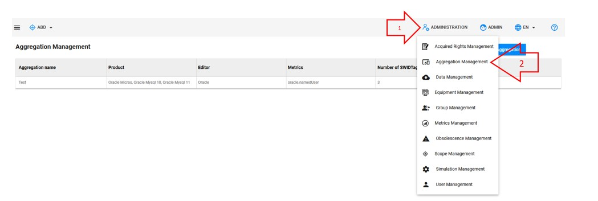{: .zoom}

## Presentation

The presentation table is : 

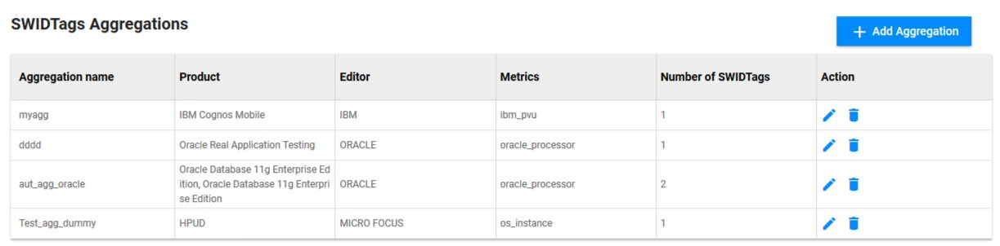{: .zoom}

You can see :  
- Aggregation name : The name of the aggregation  
- Product : The list of the products in the aggregation  
- Editor : The editor of the products in the aggregation  
- Metrics : The metric of the products in the aggregation  
- Number of SWIDTags : The number of SWIDTags in the aggregation  

## Possibilities

You can do 3 things from there :  
- Add a new aggregation ([here](#add-a-new-aggregation))  
- Edit an existing aggregation ([here](#edit-an-existing-aggregation))  
- Delete an existing aggregation ([here](#delete-an-existing-aggregation))  

When many switags of the aggregation reference the same product, this product is diplayed only once.

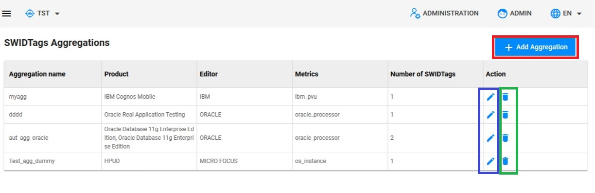{: .zoom}

## Add a new aggregation

You have to click on "Add aggregation" : 

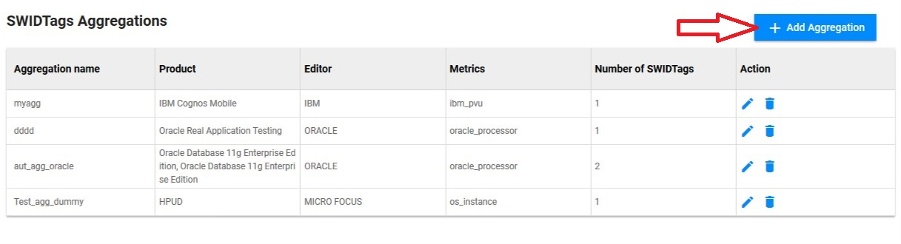{: .zoom}

This window will be shown : 

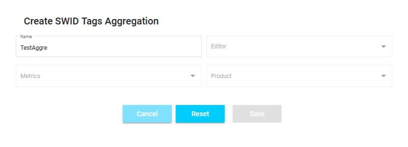{: .zoom}

You can see these different fields :  
- Name : The name of the new aggregation  
- Editor : Select the editor on which you want to create an aggregation  
- Metrics : Select the metric on which you want to create an aggregation  
- Product : Select the products on which you want to create an aggregation  

Once you have filled the name, editor and metrics field of the aggregation as shown below : 

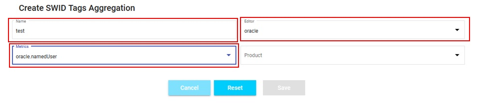{: .zoom}

You are able to choose the products that you want to add to your aggregation by SWIDTags.  

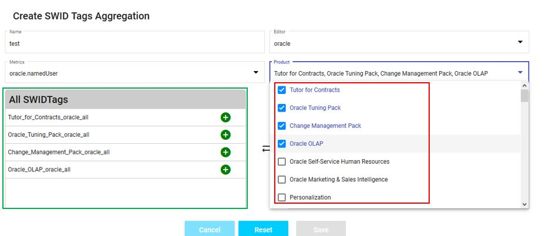

All products choosen will be add in the at the left green box.  
To add definitively the products to the aggregation, click on the green button(plus) of each products.  

After that you can see the all the products at the right in the blue box.
You can remove a product of the aggregation by clicking on the red button(minus).   

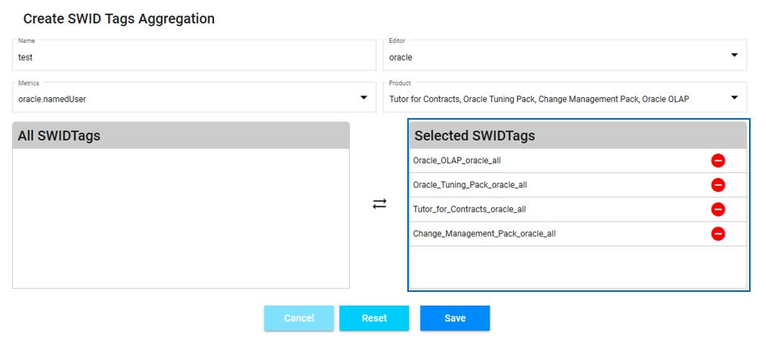

Once it's done, you can click on "Save" and the new aggregation will be created ! 

## Edit an existing aggregation

You have to click here to edit an existing aggregation : 

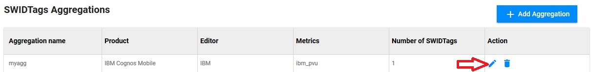{: .zoom}

This window will be shown : 

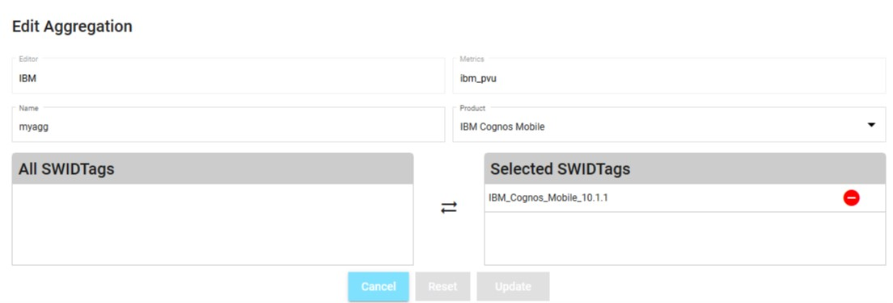{: .zoom}

You can change :  
- Name : The name of the aggregation  
- Product : The products of the aggregation  
- SWIDTags : The selected SWIDTags for the products in the aggregation  

Once it's done, you can click on "Update" and the aggregation will be updated ! 

## Delete an existing aggregation

You have to click here to delete an existing aggregation : 

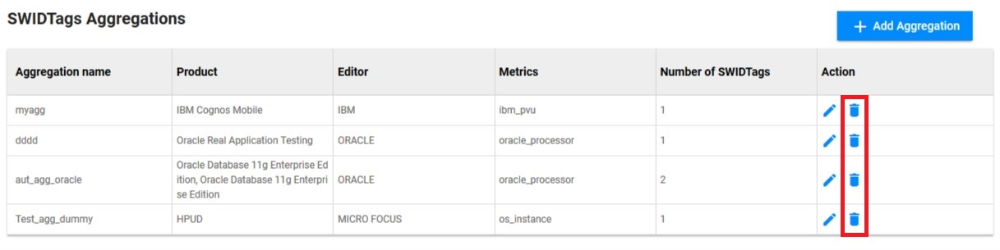{: .zoom}

This window will be shown : 

{: .zoom}

You just have to click on "OK" to delete the aggregation !

